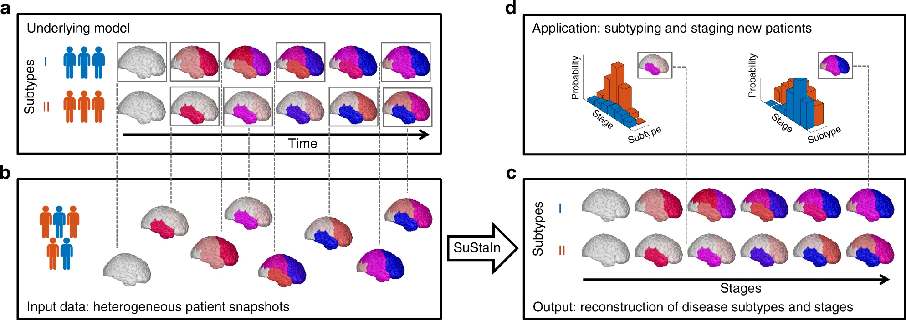

# Model for Subtyping and Staging Inference (SuStaIn)
_source: Uncovering the heterogeneity and temporal complexity of neurodegenerative diseases with Subtype and Stage Inference, AL Young et al., Nature Communications._

Conceptual overview of SuStaIn. The Underlying model panel (a) considers a patient cohort to consist of an unknown set of subtypes. The input data (Input data panel, b), which can be entirely cross-sectional, contains snapshots of biomarker measurements from each subject with unknown subtype and unknown temporal stage. SuStaIn recovers the set of subtypes and their temporal progression (as shown in the Output panel, c) via simultaneous clustering and disease progression modelling. Given a new snapshot, SuStaIn can estimate the probability the subject belongs to each subtype and stage, by comparing the snapshot with the reconstruction (as shown in the Application panel, d). This figure depicts two hypothetical subtypes, labelled I and II, and the biomarkers are regional brain volumes, but SuStaIn is readily applicable to any scalar biomarker and any number of subtypes. The colour of each region indicates the amount of pathology in that region, ranging from white (no pathology) to red to magenta to blue (maximum pathology)

This work used the SuStaIn model to discover the aging brain subtypes.

- Some scientific papers about the SuStaIn method:
  - [Vogel, et al., Nature Medicine 2021](https://www.nature.com/articles/s41591-021-01309-6)
  - [Young et al., Nature Communications 2018](https://www.nature.com/articles/s41467-018-05892-0)
